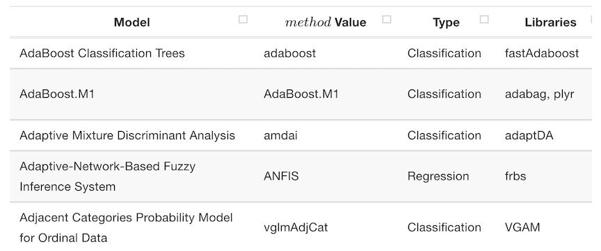

```{r setup, include = FALSE}
library(plyr)
library(tidyverse)
library(knitr)
library(caret)
library(recipes)
library(nnet)
library(xgboost)
opts_chunk$set(echo = TRUE, warning = FALSE, cache = TRUE, fig.width = 4)
# Data source: https://archive.ics.uci.edu/ml/machine-learning-databases/pima-indians-diabetes/pima-indians-diabetes.data
d <- read_csv("https://archive.ics.uci.edu/ml/machine-learning-databases/pima-indians-diabetes/pima-indians-diabetes.data",
              col_names = c("n_preg", "glucose", "BP", "skin_fold",
                            "insulin", "BMI", "pedigree", "age", "diabetes"))
write_csv(d, "pima.csv")
# Replace impossible zeros with NA:
for (column in c("BP", "skin_fold", "insulin", "BMI", "age"))
  d[[column]][d[[column]] == 0] <- NA
d$BMI <- ifelse(d$BMI < 18.5, "underweight", 
                ifelse(d$BMI < 25, "healthy", 
                       ifelse(d$BMI < 30, "overweight", "obese"))) %>%
  forcats::fct_relevel("underweight", "normal", "overweight") 
d$diabetes <- factor(ifelse(d$diabetes, "Y", "N"))
d <- d[, c(9, 1:8)]
```


## Machine Learning with `caret` & `recipes`


<p class="black">
Michael Levy (Health Catalyst)
SLC Practical Data Science Meetup  
2017-11-02
</p>

## What is `caret`?


<div class="double">

<p class="double-flow">

> The caret package (short for **C**lassification **A**nd **RE**gression **T**raining) is a set of functions that attempt to streamline the process for creating predictive models.

In turn, caret relies on a great number of other packages that implement predictive models. Here, we're using `xgboost` and `nnet` for gradient boosted machines and neural networks, respectively.

</p><p class="double-flow">

```{r, out.height = 300, echo = FALSE}
include_graphics("http://static1.squarespace.com/static/51156277e4b0b8b2ffe11c00/t/51157487e4b0b8b2ffe16829/1509217882069/")
```

</p>
</div>

## Dataset -- Pima Indian Diabetes {.smaller}

<https://archive.ics.uci.edu/ml/datasets/pima+indians+diabetes>

```{r summary, echo = FALSE}
d
```

## Withhold test data

```{r tt split}
set.seed(63784)
for_training <- caret::createDataPartition(
  y = d$diabetes,       # outcome variable. Split proportionally.
  p = .85,              # Fraction of the data for training
)[[1]]                  # Always returns a list
for_training[1:20]
training <- dplyr::slice(d, for_training)
testing <- dplyr::slice(d, -for_training)
```

Also:

- Time-series splitting with `createTimeSlices`
- Split on groups with `groupKFold`

## Pre-processing with `recipes`

> The recipes package is an alternative method for creating and preprocessing design matrices that can be used for modeling or visualization.

- Grew out of `caret`'s preprocessing functionality. 
  - Comprehensive
  - Sequential
  - Efficient
  - `tidyverse`-style API

## A recipe

Define a "recipe" for model matrix construction via a series of step transformations. 

```{r}
my_recipe <- 
  training %>%
  recipe(diabetes ~ .) %>%
  step_meanimpute(all_numeric()) %>%
  step_knnimpute(all_nominal(), -diabetes, K = 3) %>%
  step_center(all_numeric()) %>%
  step_scale(all_numeric()) %>%
  step_dummy(BMI) %>%
  step_interact(~ (. - diabetes) ^ 2)  
```

## What's in a recipe?

```{r}
my_recipe
```

## Baking from recipes

```{r}
my_recipe <- prep(my_recipe)  # Does needed calculations
training_matrix <- bake(my_recipe)  # Applies transformations
```

## Baked data

```{r}
tibble::glimpse(training_matrix)
```

## Cross-validation

Like a recipe, define instructions for hyperparameter tuning.

```{r}
cv_details <- caret::trainControl(
  method = "cv",      # or repeat cv, bootstrapping, oob...
  number = 5,         # Numnber of folds
  classProbs = TRUE,  # Want probabilities?
  summaryFunction = twoClassSummary,  # Evaluation criteria
  search = "random"  # or grid or some fancier methods
)
```

## Model training

Start by training a neural network.

```{r}
nn <- caret::train(
  x = training_matrix, 
  y = training$diabetes, 
  method = "nnet", 
  trControl = cv_details, 
  metric = "ROC", 
  tuneLength = 5
)
```

## Model training

```{r, echo = FALSE}
nn
```

## Pick a model, any model!



## Train xgb trees

```{r}
xgb <- caret::train(
  x = training_matrix, 
  y = training$diabetes, 
  method = "xgbTree", 
  trControl = cv_details, 
  metric = "ROC", 
  tuneLength = 5, 
)
```

## Train xgb trees

```{r, echo = FALSE}
xgb
```

## Model performance over hyperparameters

```{r, fig.width = 8}
ggnn <- ggplot(nn) + ggtitle("Neural Net")
ggxgb <- ggplot(xgb) + ggtitle("XGB Trees")
cowplot::plot_grid(ggnn, ggxgb, nrow = 1, rel_widths = c(.5, .6))
```

## Comparing model performance

<div class="double">

<p class="double-flow">

```{r, fig.height = 2.5, fig.asp = 1}
nn_roc <- pROC::roc(
  training$diabetes, 
  predict(nn, type = "prob")$Y) 
plot(nn_roc, main = paste0("NN AUC = ", round(nn_roc$auc, 2)))
```

</p><p class="double-flow">

```{r, fig.height = 2.5, fig.asp = 1}
xgb_roc <- pROC::roc(
  training$diabetes, 
  predict(xgb, type = "prob")$Y) 
plot(xgb_roc, main = paste0("XGB AUC = ", round(xgb_roc$auc, 2)))
```

</p>
</div>

## Putting model in production

A "new" dataset has just come in and we want to make predictions.

How to apply all those transformations we did before training?

Use the same recipe:

```{r}
# Apply transformations:
testing_matrix <- bake(my_recipe, newdata = testing)
# Make predictions:
preds <- predict(xgb, testing_matrix, type = "raw")
```

## Evaluate predictions

```{r, fig.width = 3, fig.asp = 1}
caret::confusionMatrix(preds, testing$diabetes)
```

## Resources

- `caret`: <https://topepo.github.io/caret>
- `recipes`: <https://topepo.github.io/recipes/>
- This presentation: <https://github.com/michaellevy/caret_talk>
- Feel free to contact me: <https://twitter.com/ucdlevy>
